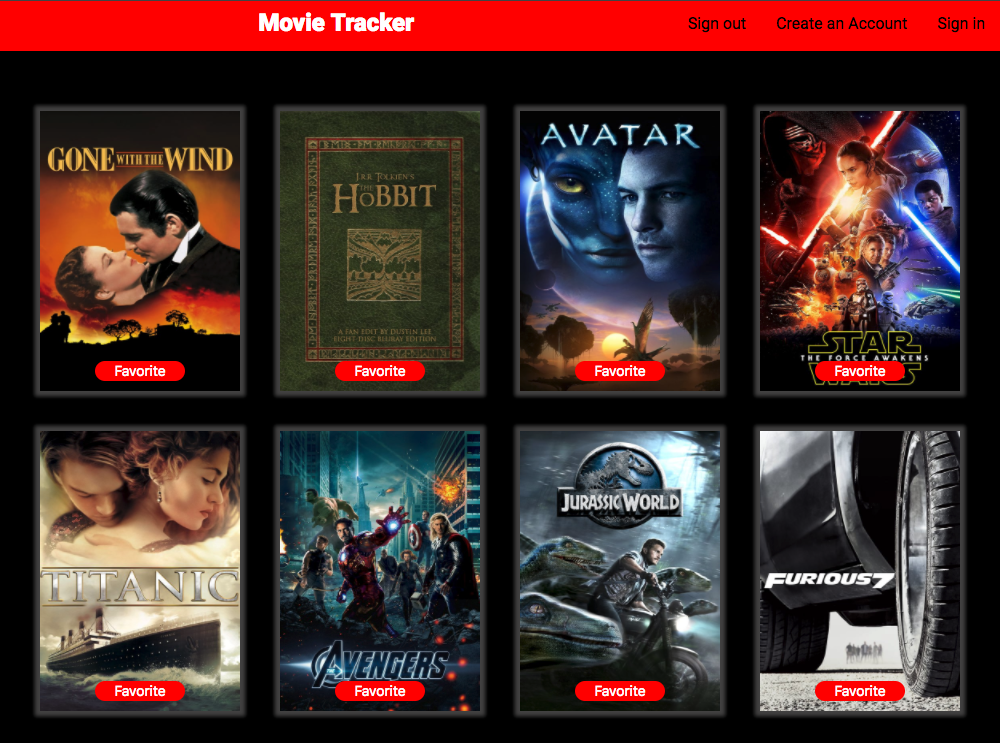
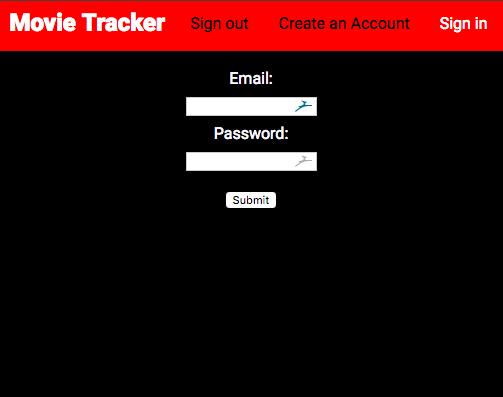
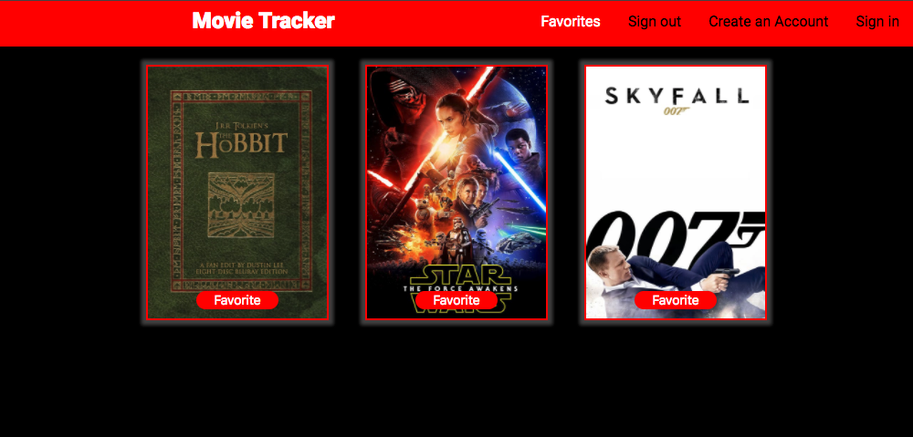

# Movie Tracker

Using the [Movie DB API](https://www.themoviedb.org/documentation/api), our group created an application to browse and favorite films. 

This project was bootstrapped with [Create React App](https://github.com/facebookincubator/create-react-app).

Class project for 3rd quarter of the Turing School Front End Engineering program (2018).

### Stack
- React
- Redux
- Router
- Express / Node.js backend from https://github.com/turingschool-examples/movie-tracker

  

 

 